# Procesverslag
Markdown is een simpele manier om HTML te schrijven.  
Markdown cheat cheet: [Hulp bij het schrijven van Markdown](https://github.com/adam-p/markdown-here/wiki/Markdown-Cheatsheet).

Nb. De standaardstructuur en de spartaanse opmaak van de README.md zijn helemaal prima. Het gaat om de inhoud van je procesverslag. Besteedt de tijd voor pracht en praal aan je website.

Nb. Door *open* toe te voegen aan een *details* element kun je deze standaard open zetten. Fijn om dat steeds voor de relevante stuk(ken) te doen.

## Jij

uitwerken voor kick-off werkgroep

### Auteur:
Janice van Diest

#### Je startniveau:
Blauw

#### Je focus:
Surface plane
 

## Je website

uitwerken voor kick-off werkgroep

### Je opdracht:
<a> https://www.dunkin.nl/</a>

#### Screenshot(s) van de eerste pagina (small screen): 
Dunkin'  
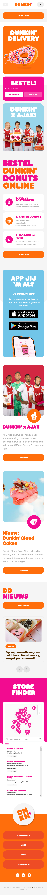

#### Screenshot(s) van de tweede pagina (small screen):
Dunkin'
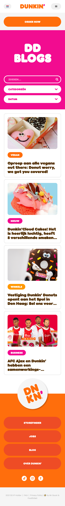
 

## Breakdownschets (week 1)

uitwerken na afloop 2e werkgroep

### de hele pagina: 
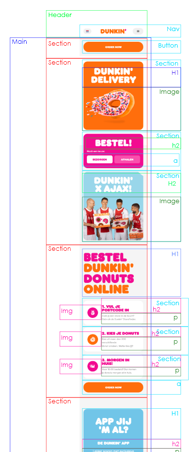
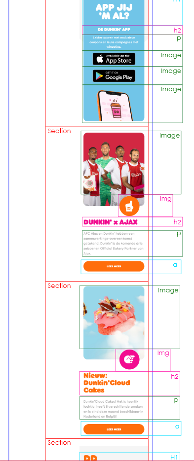

### dynamisch deel (bijv menu): 
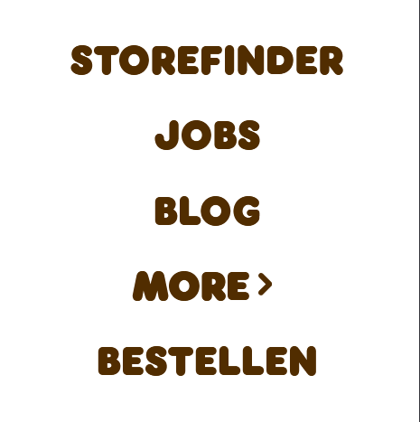

## Voortgang 1 (week 2)

uitwerken voor 1e voortgang

### Stand van zaken
Ik had tijdens deze voortgang nog geen HTML geschreven.

### Agenda voor meeting
samen met je groepje opstellen

Bas;
-hoe je transitions in css nog spannender kan maken.
-hoe je je code netjes houd

Janice;
-Hoe laat ik om de zoveel tijd een image bewegen?
-Hoe laat ik iets (bijv. een tekst/a) in en uit zoomen als ik eroverheen hover of aanklik.

Jesse;
-Hoe organiseer ik mijn CSS het beste?
-Waar leer ik meer over responsive design?

### Verslag van meeting
hier na afloop snel de uitkomsten van de meeting vastleggen

Organisatie van css staat op dlo. Animaties van images is verder ook te vinden op dlo en is in codepen uitgewerkt. 

## Voortgang 2 (week 3)

uitwerken voor 2e voortgang

### Stand van zaken
Html was volledig geschreven, standaard css toegepast.

De html is opgebouwd uit sections. De sections zijn makkelijk te onderscheiden doordat deze verschillende kleuren en h1/h2 hebben.
Elke section heb ik getitled om alles overzichtelijk te houden.

Ik heb deze week nog alleen standaard css toegevoegd, ik heb alle sections een nth of type gegeven zodat ik elke section apart kan maken. Ik heb ook de algemene gedeeltes gemaakt als de fonts, a, h1/h2 en p's. ik heb voor deze de kleuren en groottes al vastgesteld zodat dit later als nodig is per section veranderd kan worden (het algemene gedeelte is wel al af). De css heb ik ook weer getitled om het overzichtelijk te houden welk section nth of type wat is.

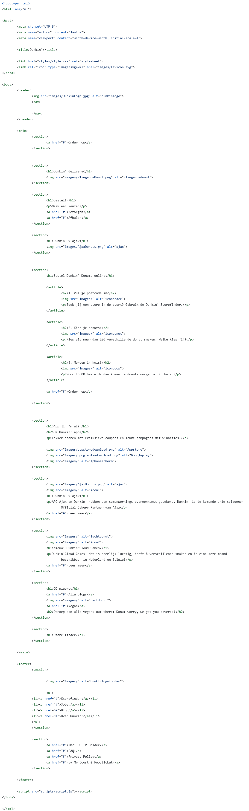

### Agenda voor meeting
samen met je groepje opstellen

-geen agenda samengesteld met groepje.

### Verslag van meeting

## Toegankelijkheidstest (week 4)

uitwerken na test in 8e voortgang

### Bevindingen
Lijst met je bevindingen die in de test naar voren kwamen:

#### Screenreader
+ De screenreader las alle elementen voor van de pagina en het las de elementen ook op goede volgorde.

#### Contrastbril 
- De kleuren zijn lastig te zien dus het is lastig om te zien wat een button is of niet.

+ De elementen met een functie een bepaalde vorm te geven waardoor je het kan herkennen is misschien een oplossing.

+ wat meer consistentie hebben in elementen.

#### Central vision weg 
+ Alles van de website is wel te zien en je kan makkelijk bewegen door de website heen.

- De elementen zijn best dicht op elkaar, dus er kan wat meer ruimte tussen de elementen komen.

#### Toetsenbord en muis 
+ De gebruiker kan overal doorheen met een toetsenbord en muis.

## Voortgang 3 (week 4)

uitwerken voor 3e voortgang

### Stand van zaken

Css van index zowat af, images positioned. Blogs.html is al geschreven en heeft een id gekregen om de styling gepast gemaakt kan worden.
Doordat blogs.html bestaat uit sections die al een keer voorkomt in de index was de styling snel te maken. Blogs.html bestaat verder alleen nog uit een simpele form om te filteren tussen de blogpagina's (dit zijn er maar 4). Javascript was voor waar het nodig is, al geschreven. De javascript is voor nu alleen nog voor het openen van het menu. De passende css en html is toegevoegd om een werkende uitklapbare nav bar te maken.

index.html ingeklapt en af
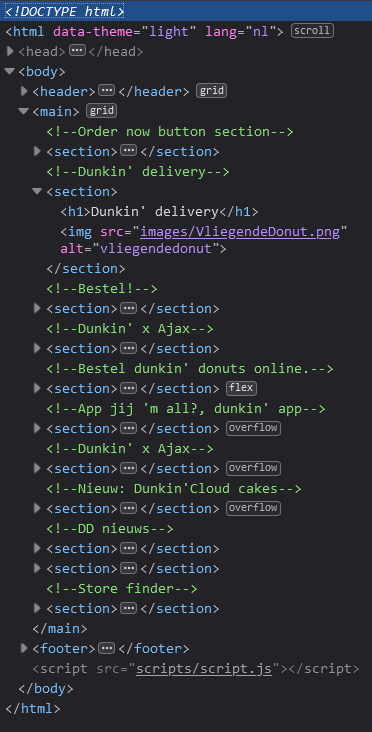

eerste versie blogs.html
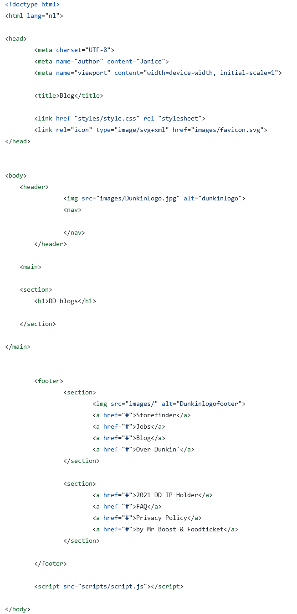

blogs sections
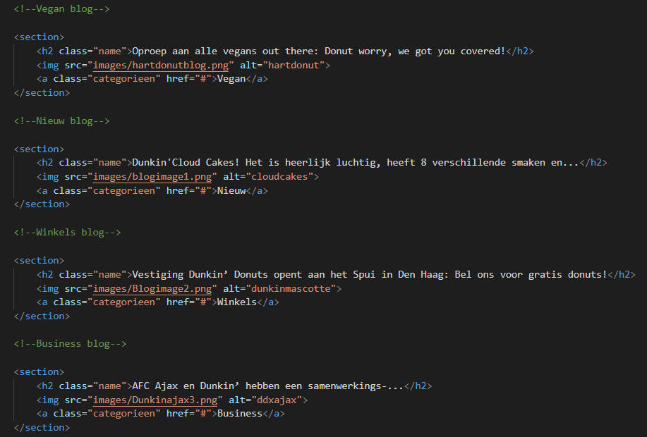

blogs form
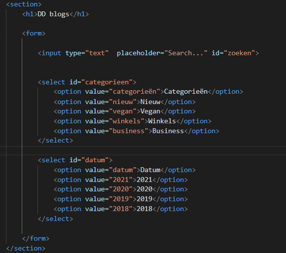

menu html
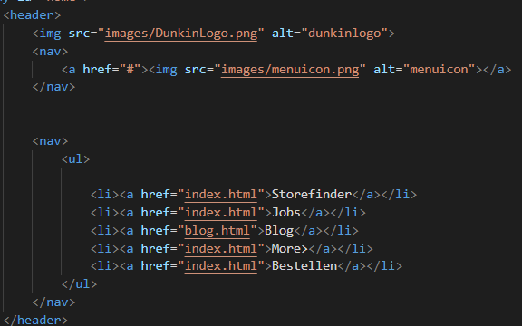

menu javascript
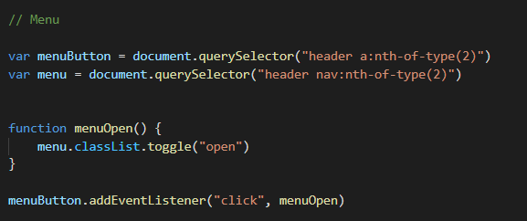

menu css
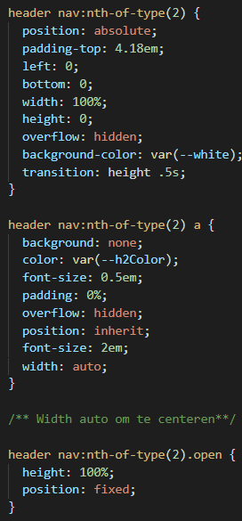

### Agenda voor meeting
samen met je groepje opstellen

-geen agenda samengesteld met groepje.

### Verslag van meeting
hier na afloop snel de uitkomsten van de meeting vastleggen

## Eindgesprek (week 5)

uitwerken voor eindgesprek

### Stand van zaken
De html schrijven met behulp van sections was makkelijk en fijn mee te werken. Tijdens het werken was het handig om gelijk titels te geven om alles overzichtelijk te houden. Css schrijven met behulp van nth-of-type was snel te begrijpen nadat ik het een keer gezien had. Ik heb soms wel moeite met het moeten kiezen tussen de manieren om dingen als images te bewegen. Javascript was geen grote uitdaging doordat deze niet veel uitwijkde van inleiding programmeren. 

De laatste toepassingen zijn de dark/light mode en het geluid als de nav bar openklapt. Verder is de blogs pagina afgemaakt door de form te stylen.

### Screenshot(s)

Screenshots eerste kans
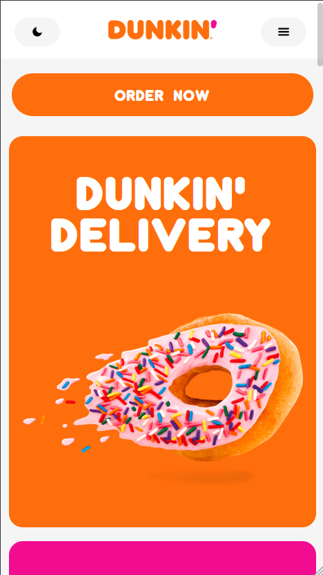
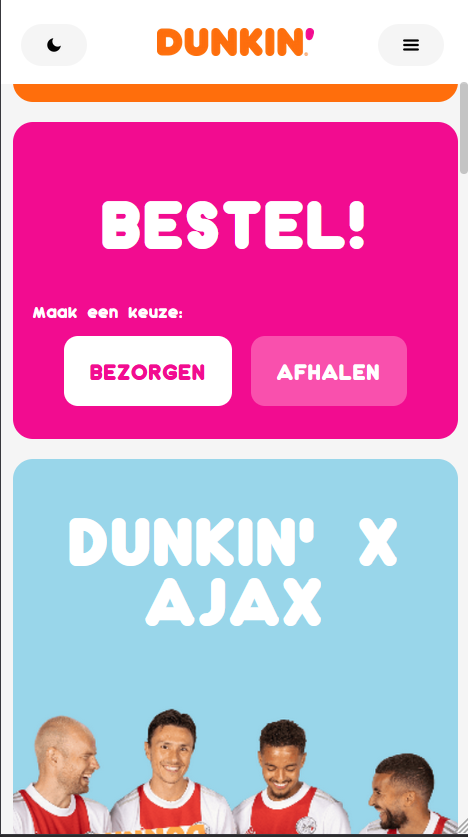
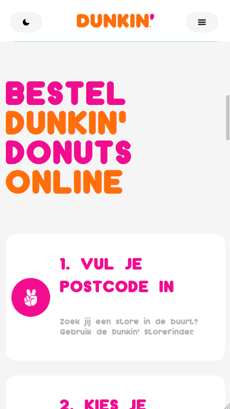
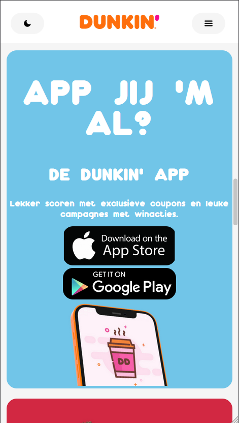
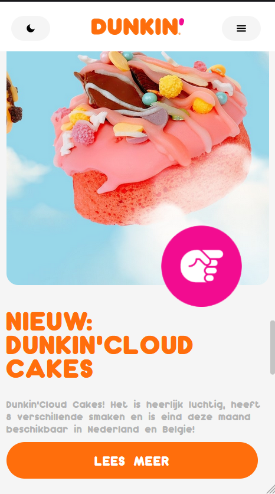
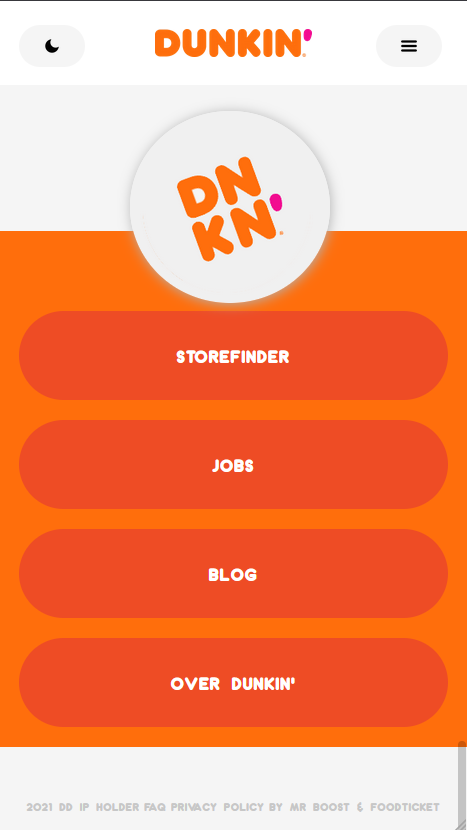

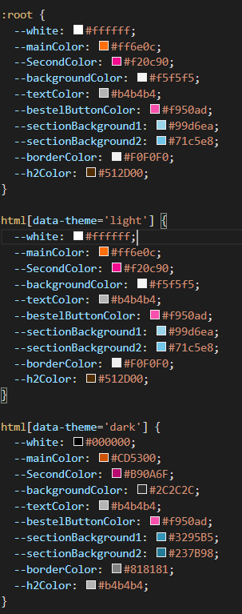

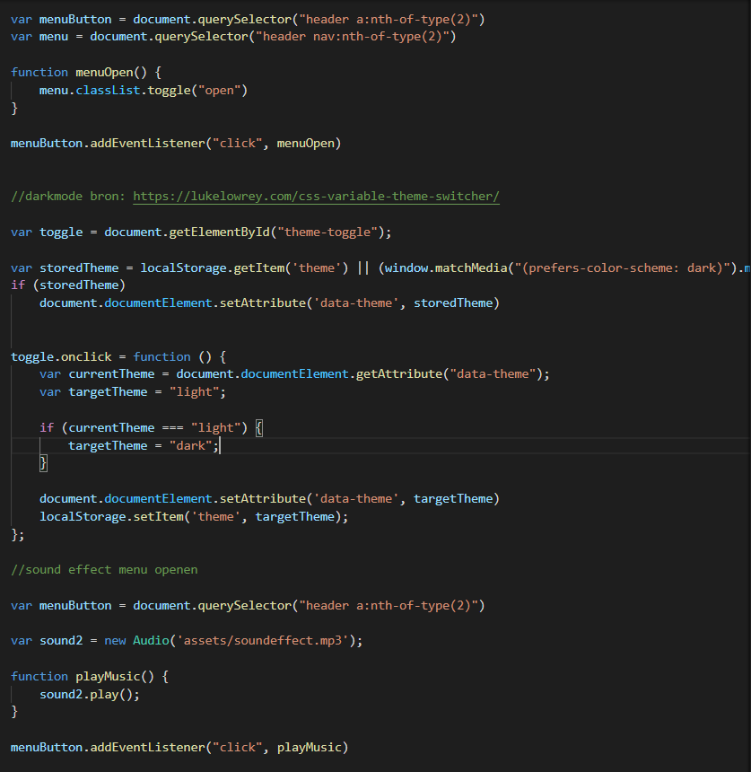

## Herkansing 

Om te herkansen moest ik de volgende dingen aanpassen/toevoegen:
-Ik moest de maan van dark mode kunnen veranderen naar een zon wanneer de dark mode is geactiveerd.
-Ik miste nog 2 surface plane elementen.
-Ik moest de buttons states geven. + de buttons waren niet goed responsive.
-Als laatst moest ik het document netter maken door css te verwijderen die niets deed en de goede volgordes te geven tussen h1/h2 en images.

Maan naar zon
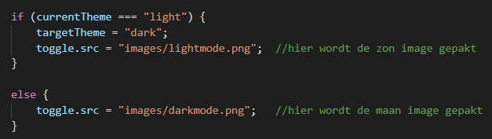

2 surface plane elementen:

-Loading screen met animation

css

html
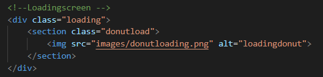

javascript
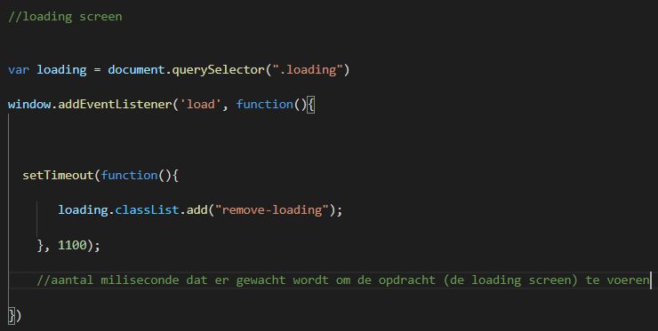

-werkend search bar 

html
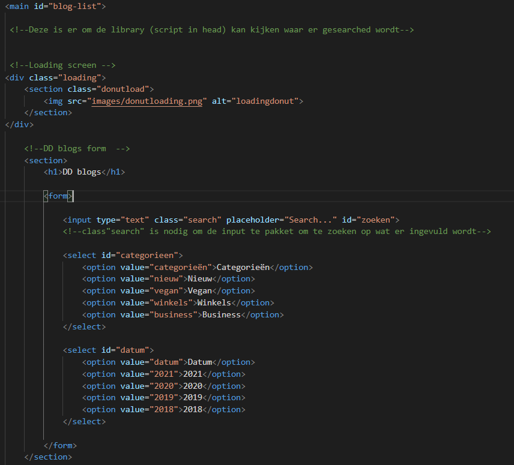
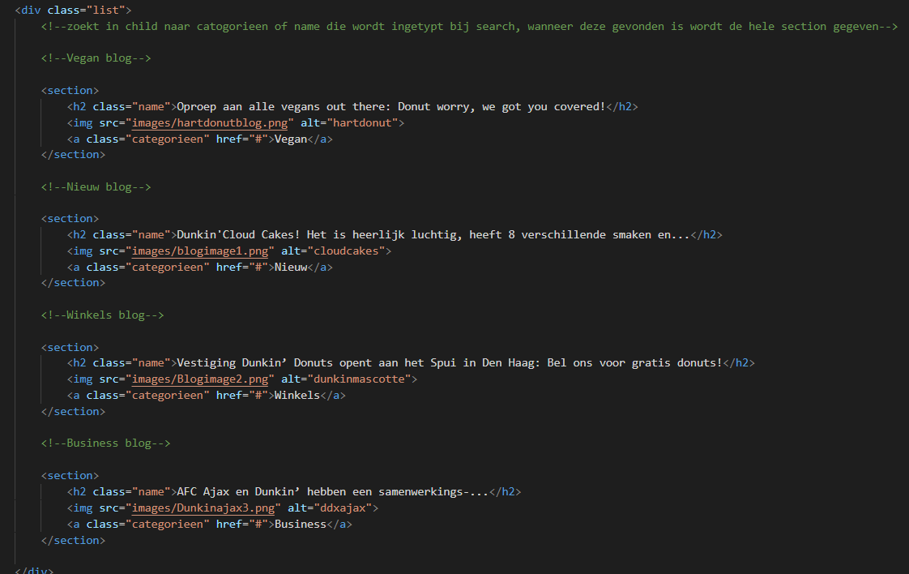

javascript
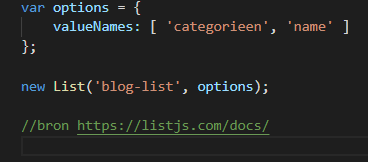

Button responsive + state

-Eerste versie van a buttons
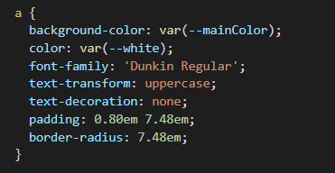

-Tweede versie a buttons met hover + active
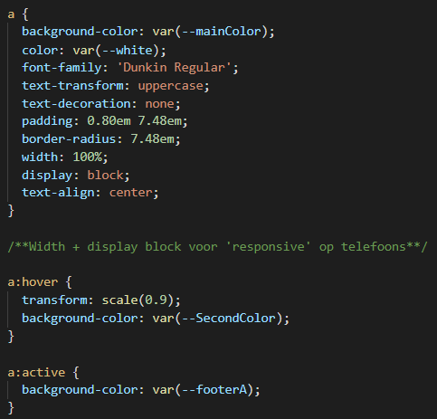

Menu openen en geluid gecombineerd
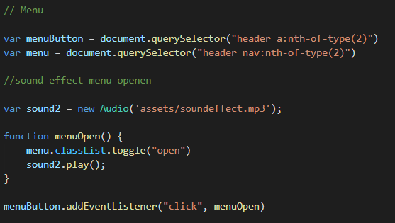

Root css aangepast lightmode als standaard kleuren
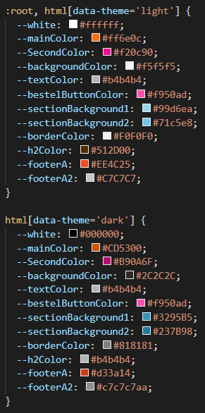

Laatste versies

Index
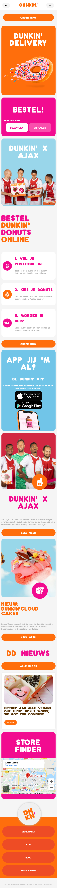
Blogs
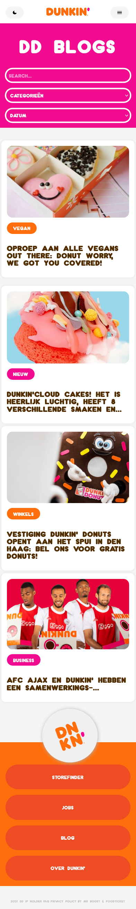

## Bronnenlijst

continu bijhouden terwijl je werkt

1. Dark mode https://lukelowrey.com/css-variable-theme-switcher/
2. https://www.dunkin.nl/blog
3. werkende form

